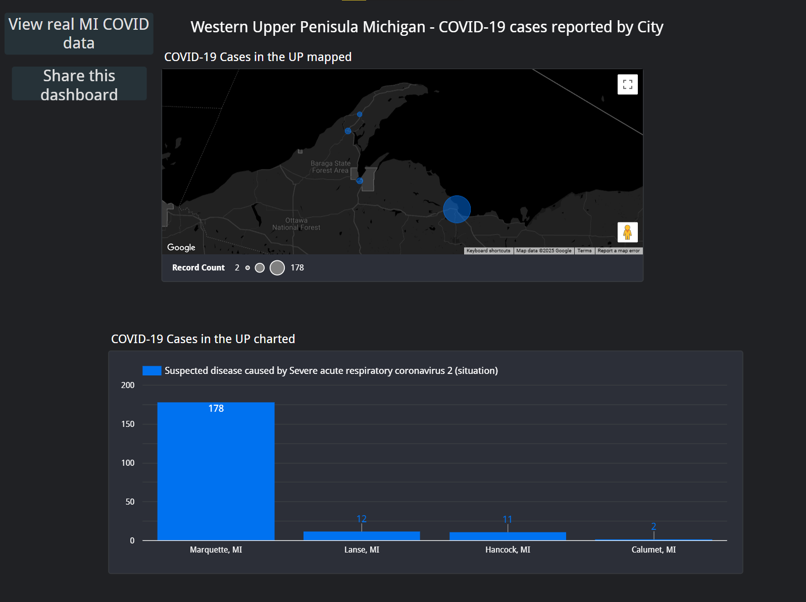

# Public Health Disease Surveillance Architecture Development Project

## Project Overview

This project demonstrates the deployment and usage of a multi-node, interoperable architecture for **disease surveillance** using health informatics tools.

We implemented an environment of **five Linux-based virtual machines**, simulating four independent Upper Peninsula hospitals using **OpenEMR** and a centralized **HAPI-FHIR** server for **FHIR-based data exchange**, all within **Michigan Tech's VCenter**.

Additional tools used:
- **Synthea** for synthetic COVID patient data generation 
- **Google Looker Studio** for creating the dashboard

---

## Project Assignments

### 1. Virtual Machine Configuration and Testing
- Setup 5 Linux-based VMs in **Michigan Tech's vCenter** with networking configured. 

### 2. OpenEMR Setup and Security
- Installed and configured **OpenEMR** on the four hospital VMs and applied basic security measures

### 3. Generation of Synthea Patient and Syndromic Surveillance Data for Hospital EHRs to Simulate Disease Outbreak
- Generated synthetic data

### 4. HAPI FHIR Server Installation
- Installed and setup a standalone **HAPI FHIR server** on the fifth VM

### 5. FHIR Interoperability & Exchange
- Demonstrate Hapi-FHIR exchanging HL7 FHIR messages and gain profiency in utilizing it. 

### 6. (Optional) Extra Credit: Visualization Dashboard
- Used **Google Looker Studio** to create a dashboard. 

---

## Project Structure

```
Public_Health_Surv_Arch/
│
├── Architecture-Diagram.png                # High-level system architecture provided by instructor
├── host_info.txt                           # VM IPs, hospital, compatability, and credentials (credentials removed from public repo) 
├── Looker_Studio_Dashboard_Screenshot.png  # Final dashboard visualization
├── Looker_Studio_DataSources.png           # Looker Studio Connected Datasources
├── LabDocs/                                # Lab submissions for each project assignment 
│   ├── Arch2.docx
│   ├── ArchDevPt3 (1).docx
│   ├── ArchDevPt5 (1).docx
│   ├── Pt4_arch (1).docx
│   └── UPHealth_Pt6 (1).docx
├── readme.md                               # You are here!!
```

---

## Contributions

Developed and implemented the full surveillance architecture as seen in the Project Assignments above.

This project demonstrates the usage of health informatics tools and how they can be used to respond to outbreaks. 

---

## Screenshots

| Architecture | Dashboard |
|--------------|-----------|
|  |  |

---

## Acknowledgements

Thanks to my instructors for instructing us in these tools. 

---
